#review: DRAFT
# Foundational Engineering Training
### 01 — Foundational Engineering — Research Synthesis

---

## Concept Map & Research Synthesis

### Topic

Foundational Engineering Training — Phase 0 Shared Core (2-week compressed track)

### Sources

Synthesized from 7 research modules in `input/0-foundations`:

| # | Module | File |
|---|--------|------|
| 1 | Git and Code Review Discipline | `input/0-foundations/01-git-and-code-review-discipline.md` |
| 2 | Linux and Networking Basics | `input/0-foundations/02-linux-and-networking-basics.md` |
| 3 | Containers | `input/0-foundations/03-containers.md` |
| 4 | Observability 101 | `input/0-foundations/04-observability-101.md` |
| 5 | Security Hygiene | `input/0-foundations/05-security-hygiene.md` |
| 6 | AI-Assisted Development | `input/0-foundations/06-ai-assisted-development.md` |
| 7 | Technical Writing | `input/0-foundations/07-technical-writing.md` |

### Common Threads Across All Sources

- The unifying skill is **legibility** — making work easy for another engineer or a future self to understand, trust, and reverse.
- Same discipline applies whether a **human or an AI** authored the code; small-scope, human-owned review is required either way.
- A single systematic **diagnostic habit** (a verbose/timed request, journalctl filtering) replaces guessing during incidents.
- **Observability is instrumenting for unanticipated questions**, not just building dashboards.
- **Static, long-lived credentials are standing liabilities**; short-lived, scoped identity is preferred.
- Containers must be **deliberately slimmed and secured**, not just made to run.
- Well-scoped **documentation triads** (README / ADR / runbook) beat high volumes of low-value documents.

### Structured Outline

```
Foundational Engineering — Phase 0 Shared Core
│
├── A. Engineering Discipline (Legibility & Team Workflow)
│   ├── Trunk-based development
│   │   ├── Frequent integration (hours, not weeks)
│   │   └── Feature flags for in-progress work
│   ├── Pull requests & code review
│   │   ├── Small, focused changes (~200–400 changed lines)
│   │   ├── Shared comment vocabulary (optional vs blocking)
│   │   └── "Rubber-stamping" as a failure mode
│   ├── Semantic (Conventional) commits — type(scope): description
│   │   └── Auto versioning + auto changelog
│   └── Review as teaching & recognition, not only fault-finding
│
├── B. System & Network Literacy
│   ├── Shell fluency — inspect a running system fast (no GUI)
│   ├── systemd & service management — systemctl, unit ordering (Before/After)
│   ├── journalctl & structured OS-level logs (indexed key-value)
│   └── Request pipeline: DNS → TCP → TLS → request → response
│       └── curl -v as diagnostic instrument (localize the failing stage)
│
├── C. Containers
│   ├── Docker fundamentals — image vs container, .dockerignore, ephemeral
│   ├── Multi-stage builds — build env vs runtime env separation
│   ├── Base image discipline — size + attack surface (alpine/slim/distroless)
│   └── One concern per container (guideline, not absolute rule)
│
├── D. Observability
│   ├── Three pillars — logs / metrics / traces
│   ├── Pillars are not interchangeable (manual logs vs auto traces)
│   ├── Structured logging (JSON, machine-parseable)
│   └── Observability ≠ monitoring — answer unanticipated questions
│
├── E. Security Hygiene
│   ├── Secrets management — never embed; runtime retrieval
│   ├── Static credentials vs OIDC workload identity federation
│   ├── Principle of least privilege (humans + workloads)
│   └── Case study: 2025 Red Hat self-managed GitLab breach
│
├── F. AI-Assisted Development
│   ├── Documented outcomes — more issues, lower acceptance, more review time
│   ├── Failure modes — hallucinated interfaces, context blindness
│   ├── Scope-first review — short scope + checkable acceptance criteria
│   ├── Automated tools for patterns; humans for business-logic judgment
│   └── Universal Working Cycle: Evaluate → Plan → Apply → Validate
│       └── Prompt techniques: Role+Context+Task+Format+Constraints
│
└── G. Technical Writing
    ├── README — what/why/how to run, usage, config
    ├── ADR — decision + reasoning + trade-offs (not design doc/RFC/notes)
    └── Runbook — procedural, pressure-tested, operational
        └── Keep the three categories distinct
```

### Visual Concept Map

```mermaid
flowchart TD
    A[Phase 0<br/>Foundational Engineering]:::core
    A --> B[Engineering Discipline]:::a
    A --> C[System & Network Literacy]:::b
    A --> D[Containers & Shipping]:::c
    A --> E[Observability]:::d
    A --> F[Security Hygiene]:::e
    A --> G[AI-Assisted Development]:::f
    A --> H[Technical Writing]:::g

    B --> B1[Trunk-Based Development]:::a
    B --> B2[Small PRs & Code Review]:::a
    B --> B3[Conventional Commits]:::a
    B --> B4[Review as Teaching]:::a

    C --> C1[Shell Fluency]:::b
    C --> C2[systemd / journalctl]:::b
    C --> C3[DNS - TCP - TLS Pipeline]:::b
    C --> C4[curl -v Diagnostics]:::b

    D --> D1[Docker Fundamentals]:::c
    D --> D2[Multi-Stage Builds]:::c
    D --> D3[Base Image Discipline]:::c
    D --> D4[One Process per Container]:::c

    E --> E1[Logs]:::d
    E --> E2[Metrics]:::d
    E --> E3[Traces]:::d
    E --> E4[Structured Logging]:::d
    E --> E5[Observability vs Monitoring]:::d

    F --> F1[Secrets Management]:::e
    F --> F2[OIDC Workload Identity]:::e
    F --> F3[Least Privilege]:::e
    F --> F4[2025 Red Hat GitLab Case]:::e

    G --> G1[AI Code Outcomes]:::f
    G --> G2[Scope-First Review]:::f
    G --> G3[AI Tools vs Human Judgment]:::f
    G --> G4[Working Cycle & Prompting]:::f

    H --> H1[README]:::g
    H --> H2[ADR]:::g
    H --> H3[Runbook]:::g

    C2 -.bridges to.-> E1
    C3 -.localizes.-> C4
    G -.applies to.-> B2
    G -.produces.-> H
    F -.informs.-> B2
    E -.records.-> H

    classDef core fill:#e3f2fd,stroke:#1565c0,color:#212121;
    classDef a fill:#e8f5e9,stroke:#2e7d32,color:#212121;
    classDef b fill:#fff3e0,stroke:#e65100,color:#212121;
    classDef c fill:#fce4ec,stroke:#c62828,color:#212121;
    classDef d fill:#f3e5f5,stroke:#6a1b9a,color:#212121;
    classDef e fill:#e0f2f1,stroke:#00695c,color:#212121;
    classDef f fill:#f5f5f5,stroke:#616161,color:#212121;
    classDef g fill:#e3f2fd,stroke:#1565c0,color:#212121;
```



### Key Insights

- **Legibility is the core skill, not coding.** Across all sources, the unifying thread is making work easy for another engineer or a future self to understand, trust, and reverse — whether through small PRs, semantic commits, structured logs, or written decisions.
- **The same discipline applies whether a human or an AI wrote the code.** AI-generated changes ship at higher issue rates and lower acceptance rates, and still need small-scope, human-owned review. Reviewing generated output is now a first-class skill, not a shortcut.
- **A single diagnostic habit resolves most "unknown failures."** A verbose, timed request (curl -v) localizes a problem to one stage of the pipeline (DNS, TCP, TLS, or server), and journalctl filtering localizes OS-level issues — turning guessing into a systematic first step.
- **Observability is instrumenting for unanticipated questions.** Collecting logs, metrics, and traces is not enough; a system is only observable when a new question can be answered without shipping new code. Structured logging and correlated trace IDs make this possible.
- **Sequenced identity over secrets.** Static, long-lived credentials are standing liabilities; short-lived, scoped workload identity (OIDC federation) and least privilege reduce blast radius. The 2025 Red Hat self-managed GitLab breach was a hygiene failure (embedded credentials), not a sophisticated attack.
- **Containers must be deliberately slimmed, not just functional.** Multi-stage builds, minimal base images, `.dockerignore`, and one-concern-per-container separate a production-ready image from an oversized, insecure one.
- **Well-scoped documentation triads beat volume.** README, ADR, and runbook serve distinct jobs (usage, decision, procedure); conflating them produces low-value documents where real decisions get lost. A stale README or runbook is worse than none.

### Suggested Topic List

> Flags: `[GAP]` marks topics not covered in the provided sources. `—` otherwise.

| Day/Module | Topics | Phase | Tag |
|---|---|---|---|
| 1 | Git: trunk-based development, branches that live hours not weeks, feature flags | Version Control | — |
| 2 | PRs & code review: size limits, comment vocabulary, review as teaching | Version Control | — |
| 3 | Conventional Commits: format, semantic-release/auto-versioning, changelog | Version Control | — |
| 4 | Shell fluency: processes, ports, permissions, logs via CLI | System Ops | — |
| 5 | systemd & journalctl: service management, unit ordering, structured OS logs | System Ops | — |
| 6 | Networking pipeline: DNS, TCP, TLS handshake, HTTP; curl -v timing/stages | Networking | — |
| 7 | Docker fundamentals: image vs container, .dockerignore, ephemerality | Containers | — |
| 8 | Multi-stage builds, base image discipline (alpine/slim/distroless), one concern per container | Containers | — |
| 9 | Observability pillars: logs, metrics, traces; structured logging; correlation | Observability | — |
| 10 | Observability ≠ monitoring; cost/cardinality; OpenTelemetry | Observability | — |
| 11 | Secrets management; static credentials vs OIDC; least privilege | Security | — |
| 12 | Security case study: 2025 Red Hat GitLab breach; short-lived credentials | Security | — |
| 13 | AI code outcomes & failure modes; scope-first review; tools vs humans | AI-Assisted Dev | — |
| 14 | AI working cycle: Evaluate→Plan→Apply→Validate; prompting techniques | AI-Assisted Dev | — |
| 15 | README: structure and what it must answer | Technical Writing | — |
| 16 | ADR vs README vs Runbook; when to write and store ADRs | Technical Writing | — |
| 17 | Runbook discipline; keeping docs current and owned | Technical Writing | — |
| 18 | Capstone: containerize a service, wire logs+metric, write README, submit as PR | Capstone | — |
| 19 | Capstone review + rubric; apply AI working cycle to the build | Capstone | — |
| 20 | Capstone finalization + baseline competency check | Capstone | — |
| 21 | Automated CI checks (linting, secret scanning, PR size gates) | Tooling | [GAP] |
| 22 | Infrastructure-as-Code basics (Terraform/cloud identity) | Tooling | [GAP] |
| 23 | Deploy/rollback & release pipelines (CI/CD) | Tooling | [GAP] |
| 24 | Distributed tracing deep-dive (OpenTelemetry) | Observability | [GAP] |

**Pacing note:** The 7 source modules comfortably fill a ~4-week full-topic path (Days 1–17) plus a capstone (Days 18–20). Days 21–24 are expansion topics not covered by the sources (`[GAP]`). With the owner's 2-week constraint (10 days, 4–5 hrs/day), the topic list is **compressed/broadened** in Skill 2 rather than taught at full depth.

---

*Version: v1.0 | Created: 2026-09-04 | Author: Technical Curriculum Designer*
