#review: DRAFT
# Foundational Engineering Training
### 02 — Foundational Engineering — Learning Path Architect

---

## Learning Path Skeleton

### Metadata Block

| Field | Value |
|---|---|
| **Learning Path Title** | Foundational Engineering Training — Phase 0 Shared Core |
| **Training POC** | Jemima Villanueva |
| **Version** | v1.0 |
| **Date Created** | 2026-09-04 |
| **Created By** | Jemima Villanueva |
| **Objective** | Enable every engineer to ship legible, observable, securely-authored, AI-assisted software using standard team workflow and operational fundamentals |
| **Target Audience** | Existing engineers (mixed roles) fresh to these foundational topics |
| **Knowledge Prerequisites** | Basic Java/programming knowledge; working dev environment |
| **Tools Needed** | Git, Docker, Linux CLI, curl, a code editor, an AI assistant (Claude/Gemini/OpenCode) |
| **Total Duration** | 2 weeks · 10 working days · ~4–5 hrs/day (≈45 hrs) |

**Domains:** Software Development · Systems & Networking · DevOps/Containers · Observability · Security · AI-Assisted Development · Technical Writing

**Delivery model:** Mixed hands-on/theory. Every day's hands-on is framed by the **AI working cycle** (Evaluate → Plan → Apply → Validate). AI-assisted development is a **cross-cutting thread** woven into daily exercises, not a standalone first-week block. No capstone — daily hands-on exercises instead.

### Gantt Timeline

```mermaid
gantt
    title Foundational Engineering Training — 2 Weeks
    dateFormat  D
    axisFormat  Day %e

    section Week 1
    Git & Code Review        :a1, 0, 2d
    Linux & Networking       :a2, 2, 2d
    Containers               :a3, 4, 2d

    section Week 2
    Observability            :b1, 6, 2d
    Security & Tech Writing  :b2, 8, 1d
    AI + Integration         :b3, 9, 1d
```

---

### Day-by-Day Skeleton

#### Week 1 — Workflow, Systems, and Shipping

**Day 1 · Git & Code Review (Priority — deeper)**
- **Objective:** Restructure a workflow to trunk-based development with semantic commits and short-lived branches.
- **Concepts:** trunk-based development, branch lifetime, feature flags, Conventional Commits, semantic-release/auto-versioning.
- **Estimated time:** 4.5 hrs
- **Hands-on:** [HANDS-ON RECOMMENDED]
- **Visual:** [NO VISUAL NEEDED]
- **Hands-on activity (AI cycle-framed):** Plan → convert a toy history to Conventional Commits; Apply → merge to trunk daily; Validate → history reads cleanly.

**Day 2 · Pull Requests & Review Discipline (Priority — deeper)**
- **Objective:** Produce and review small, focused PRs with a shared comment vocabulary and teach-first culture.
- **Concepts:** PR size limits (~200–400 lines), optional vs blocking comments, rubber-stamping failure mode, review as teaching, AI code-review outcomes + scope-first review.
- **Estimated time:** 4.5 hrs
- **Hands-on:** [HANDS-ON RECOMMENDED]
- **Visual:** [NO VISUAL NEEDED]
- **Hands-on activity:** Split a large change into small PRs; author + review a PR using the comment vocabulary.

**Day 3 · Linux & Networking Basics (Consolidated)**
- **Objective:** Inspect a running Linux system and its services from the CLI without a GUI.
- **Concepts:** shell fluency, systemctl, systemd unit ordering (Before/After), journalctl filtering, structured OS logs.
- **Estimated time:** 4.5 hrs
- **Hands-on:** [HANDS-ON RECOMMENDED]
- **Visual:** [NO VISUAL NEEDED]
- **Hands-on activity:** Use journalctl to localize and explain a deliberately-failing service.

**Day 4 · Networking Request Pipeline & curl (Consolidated)**
- **Objective:** Diagnose the stage of a failing network request using a single verbose/timed request.
- **Concepts:** DNS → TCP → TLS → request → response; TLS handshake phases; curl -v timing variables; distinct error signatures.
- **Estimated time:** 4.5 hrs
- **Hands-on:** [HANDS-ON RECOMMENDED]
- **Visual:** [VISUAL RECOMMENDED] (request pipeline diagram)
- **Hands-on activity:** Run curl -v against endpoints and identify which stage fails (DNS/TCP/TLS/cert).

**Day 5 · Containers Fundamentals (Priority — deeper)**
- **Objective:** Build and run a container image following Docker's foundational best practices.
- **Concepts:** image vs container, .dockerignore, ephemerality, multi-stage builds, build caching.
- **Estimated time:** 5 hrs
- **Hands-on:** [HANDS-ON RECOMMENDED]
- **Visual:** [NO VISUAL NEEDED]
- **Hands-on activity:** Write a multi-stage Dockerfile for a small service; keep the runtime image lean.

#### Week 2 — Running, Observing, Securing, and Documenting

**Day 6 · Container Image Discipline (Priority — deeper)**
- **Objective:** Optimize a container image for size and attack surface while keeping it debuggable.
- **Concepts:** base image choice (alpine/slim/distroless), size vs debuggability trade-off, one-concern-per-container, secret-free images.
- **Estimated time:** 5 hrs
- **Hands-on:** [HANDS-ON RECOMMENDED]
- **Visual:** [NO VISUAL NEEDED]
- **Hands-on activity:** Slim a given image using multi-stage + minimal base; document the trade-off.

**Day 7 · Observability I (Priority — deeper)**
- **Objective:** Instrument a running service with structured logging and one metric.
- **Concepts:** three pillars (logs, metrics, traces), structured JSON logging, log cost/cardinality.
- **Estimated time:** 5 hrs
- **Hands-on:** [HANDS-ON RECOMMENDED]
- **Visual:** [VISUAL RECOMMENDED] (three-pillars diagram)
- **Hands-on activity:** Wire structured logging + one metric into the containerized service.

**Day 8 · Observability II (Priority — deeper)**
- **Objective:** Correlate logs, metrics, and traces to answer an unanticipated question, and distinguish observability from monitoring.
- **Concepts:** observability vs monitoring, trace-ID correlation across pillars, OpenTelemetry, retention/cost policy.
- **Estimated time:** 5 hrs
- **Hands-on:** [HANDS-ON RECOMMENDED]
- **Visual:** [NO VISUAL NEEDED]
- **Hands-on activity:** Add a trace ID to logs/metrics; reproduce and answer a new question about the running service.

**Day 9 · Security Hygiene + Technical Writing (Consolidated)**
- **Objective:** Author a README, an ADR, and a runbook for the built service, and review it for embedded secrets.
- **Concepts:** secrets management, static credentials vs OIDC, least privilege, 2025 Red Hat GitLab case; README vs ADR vs runbook distinctions.
- **Estimated time:** 5 hrs
- **Hands-on:** [HANDS-ON RECOMMENDED]
- **Visual:** [NO VISUAL NEEDED]
- **Hands-on activity:** Write README + ADR + runbook for Day-7/8 service; scan for secrets; apply least privilege.

**Day 10 · AI-Assisted Development + Integration (Thread consolidation)**
- **Objective:** Apply the full AI working cycle (Evaluate → Plan → Apply → Validate) to a small real build and produce its docs.
- **Concepts:** AI code outcomes & failure modes, scope-first review, prompts → agents → skills, context management; integration of all 7 modules.
- **Estimated time:** 5 hrs
- **Hands-on:** [HANDS-ON RECOMMENDED]
- **Visual:** [NO VISUAL NEEDED]
- **Hands-on activity:** Use the AI cycle end-to-end on a tiny feature; review the generated change (scope-first); close the day with a baseline check.

---

### Visual Decision Gate

- **Day 4** (Networking request pipeline) — flagged **[VISUAL RECOMMENDED]**
- **Day 7** (Observe pillars) — flagged **[VISUAL RECOMMENDED]**

Owner confirmed both visuals are to be kept.

---

*Version: v1.0 | Created: 2026-09-04 | Author: Technical Curriculum Designer*
