#review: DRAFT
---
tags:
  topic-slug: foundational-engineering
  skill-domains: [software-development, systems-networking, devops-containers, observability, security, ai-assisted-development, technical-writing]
  audience: existing-engineers
  difficulty: intermediate
  delivery-methods: [lecture, hands-on-lab]
  total-days: 10
  status: draft
---

# Foundational Engineering Training
### 03 — Foundational Engineering — Module Content

---

## Metadata

| Field | Value |
|---|---|
| **Title** | Foundational Engineering Training — Phase 0 Shared Core |
| **Version** | v1.0 |
| **Date Created** | 2026-09-04 |
| **Author** | Technical Curriculum Designer |
| **Target Audience** | Existing engineers (mixed roles) fresh to these foundational topics |
| **Knowledge Prerequisites** | Basic Java/programming knowledge; working dev environment |
| **Tools Needed** | Git, Docker, Linux CLI, curl, a code editor, an AI assistant (Claude/Gemini/OpenCode) |
| **Skill Domains** | Software Development, Systems & Networking, DevOps/Containers, Observability, Security, AI-Assisted Development, Technical Writing |
| **Dataset Reference** | No external dataset — self-contained hands-on builds a small local service |
| **Total Duration** | 10 days / ~45 hours |
| **Suggested Pace** | 4–5 hours per day, one day per module |

---

## Training Timeline

```mermaid
gantt
    title Foundational Engineering Training — 2 Weeks
    dateFormat  D
    axisFormat  Day %e
    section Workflow & Systems
    Git & Code Review   :p1, 1, 2d
    Linux & Networking  :p2, 3, 2d
    section Containers
    Containers          :p3, 5, 2d
    section Observability
    Observability       :p4, 7, 2d
    section Security, Docs & AI
    Sec + Tech Writing  :p5, 9, 1d
    AI + Integration    :p6, 10, 1d
```

---

## Module Content

#### Day 1: Git & Code Review — Trunk-Based Development & Conventional Commits

- **Learning Objective:** Restructure a workflow to trunk-based development with semantic commits and short-lived branches.
- **Core Idea:** Trunk-based development is a version-control approach where all engineers integrate their changes into a single shared branch, often several times a day, instead of keeping long-lived feature branches. Feature flags (a runtime toggle that hides unfinished work) let incomplete code merge safely behind a switch. Conventional Commits is a `type(scope): description` format whose types (for example `feat` for a new feature, `fix` for a bug fix) map directly to semantic versioning.
- **Why It Matters:** The longer a branch lives apart from the main branch, the more it diverges and the more painful and risky the eventual merge becomes. An engineer who cannot merge frequently or write clear commit messages produces history that is slow to review and difficult to roll back. This legibility is the foundation every later module builds on.
- **How It Works:** Engineers keep `main` always in a releasable state and treat a broken shared branch as an incident. Each change is small and integrates quickly, hidden behind a feature flag when incomplete. Commit messages follow Conventional Commits so that tooling can derive the next version number and generate a changelog automatically from history.
  - **Concepts:**
    - Trunk-based development integrates changes frequently (often multiple times a day) into a single shared branch, commonly called "main" or "trunk," instead of maintaining long-lived feature branches that can diverge for days or weeks.
    - When branches are used at all under this approach, they are expected to live for hours, not weeks, before being merged back in.
    - Trunk-based development is a required practice for continuous integration and continuous delivery, and contrasts with Gitflow, an alternative model built around long-lived feature branches and multiple primary branches.
    - Feature flags (also called feature toggles) allow unfinished or not-yet-ready code to merge directly into the shared branch hidden behind a runtime toggle, rather than being isolated in a long-lived branch.
    - Conventional Commits is a lightweight specification using a `type(scope): description` format, where the type describes the kind of change, such as a new feature versus a bug fix.
    - The two required types in Conventional Commits map directly to semantic versioning: a new feature corresponds to a minor version increase, and a bug fix corresponds to a patch version increase.
    - Tooling that follows the specification can automatically determine the next version number and generate a changelog directly from commit history, removing the need to manually track what changed in a release.
    - A commit that is difficult to categorize under a single type is often a signal that the change is doing more than one thing and should be split into separate commits.
  - **Best Practices:**
    - Keep the shared branch always in a releasable state; a broken shared branch should be treated as an incident and fixed immediately, not left for later.
    - Use a consistent commit message structure (such as Conventional Commits) so the history communicates intent and supports automated versioning and changelog generation.
    - Hide in-progress work behind a feature flag rather than isolating it in a long-lived branch.
  - **Real-World Example:** Semantic-release tooling, used across many open-source and commercial JavaScript and Node.js projects, computes version numbers and changelogs automatically from Conventional Commit history, but this only works if the team consistently follows the commit convention.
- **Supplemental Reading:**
  - 📄 [Official Documentation — Atlassian, Trunk-based Development]: https://www.atlassian.com/continuous-delivery/continuous-integration/trunk-based-development
  - 📝 [Blog/Medium Article — Marc Nuri, Conventional Commits Complete Guide]: https://blog.marcnuri.com/conventional-commits
  - 📝 [Blog/Medium Article — Unleash, Implementing Trunk-Based Development]: https://www.getunleash.io/blog/how-to-implement-trunk-based-development-a-practical-guide
  - > All links are validated before publishing.
- **Hands-on Activity:** Trunk-Based + Conventional Commits drill — Learners convert a small toy git history into Conventional Commits, hide an in-progress feature behind a feature flag, and merge to trunk daily. The expected outcome is a clean, self-explanatory history on the shared branch.
- **Visual Aid:** ✅ No — this day is procedural and does not require a diagram.

---

#### Day 2: Pull Requests & Review Discipline

- **Learning Objective:** Produce and review small, focused PRs with a shared comment vocabulary and teach-first culture.
- **Core Idea:** A pull request is a proposed change submitted for review before it is merged. Review quality measurably declines once a change exceeds roughly two hundred to four hundred changed lines, so small, focused PRs are reviewed faster and more thoroughly. A shared comment vocabulary distinguishes optional notes from blocking changes, which keeps the review process constructive rather than adversarial.
- **Why It Matters:** Code review is one of the highest-leverage moments for spreading conventions and business knowledge across a team, beyond what documentation conveys alone. "Rubber-stamping" — approving a change without genuinely reading it, often under delivery pressure or on an oversized diff — is a known failure mode. This skill transfers team context and catches defects before they reach the shared branch.
- **How It Works:** The author splits large changes into smaller, single-objective PRs. The reviewer labels each comment by severity so the author knows what is required versus optional, recognizes good work as well as problems, and asks for a split when a diff is too large to review carefully. Explicit code ownership makes review responsibility clear.
  - **Concepts:**
    - Review quality and thoroughness measurably decline once a change exceeds roughly two hundred to four hundred changed lines; smaller changes are reviewed faster, more thoroughly, and merged more often as a result.
    - "Rubber-stamping" — approving a change without a genuine review, often triggered by change size or delivery pressure — is a known failure mode more likely to occur on oversized pull requests.
    - A shared comment vocabulary that distinguishes optional or minor notes from required, blocking changes keeps review constructive and lets the author know what is mandatory.
    - Beyond defect detection, code review is one of the highest-leverage moments for spreading conventions, business logic, and the reasoning behind past decisions across a team.
    - Recognizing good work during review, not only flagging problems, keeps the review culture constructive rather than adversarial.
  - **Best Practices:**
    - Keep pull requests small and focused on one logical change; a widely cited soft limit is roughly two hundred changed lines, with a higher hard ceiling depending on the team.
    - Establish a shared vocabulary for review comments so reviewers and authors both understand which comments are optional and which are blocking.
    - Assign clear ownership of code (for example, through owner files) so review responsibility is explicit rather than left to whoever happens to be available.
    - Treat review as an opportunity to teach and to recognize good work, not only to find faults.
    - Avoid approving a change without genuinely reading it, particularly under time pressure or on a large diff; if a change is too large to review carefully, ask the author to split it.
  - **Real-World Example:** Google's internal culture of small, reviewed changes ("CLs") is the origin of review conventions that have since spread to GitHub-style pull request workflows across the industry, including the practice of labeling comments by severity.
- **Supplemental Reading:**
  - 📄 [Official Documentation — GitHub, all-about-code-review (mgreiler)]: https://github.com/mgreiler/all-about-code-review/
  - 📝 [Blog/Medium Article — Sergio Santos, Google Engineering Practices for PRs]: https://medium.com/@sdesantos/techietuesday-mastering-pull-requests-a-brief-look-at-googles-engineering-practices-ba808d17e3bf
  - 📝 [Blog/Medium Article — Engineering Manager Tools, Pull Request Size Limits]: https://www.em-tools.io/engineering-metrics/pull-request-size
  - > All links are validated before publishing.
- **Hands-on Activity:** Small PR Split + Review Drill — Learners split an oversized change into several small, single-purpose PRs, then author and review one another's PRs using the optional-versus-blocking comment vocabulary. The expected outcome is a set of small, cleanly reviewable PRs and constructive review threads.
- **Visual Aid:** ✅ No — no diagram is required for review discipline.

---

#### Day 3: Linux & Networking Basics — Shell, systemd & journalctl

- **Learning Objective:** Inspect a running Linux system and its services from the CLI without a GUI.
- **Core Idea:** Shell fluency means the reflex to quickly inspect processes, listening ports, file permissions, and logs from the command line. systemd is the init and service manager on most modern Linux distributions, controlled with `systemctl`, and its unit files can declare ordering (`Before=`/`After=`) so that dependency services start first. journalctl reads the structured, field-queryable logs that journald stores.
- **Why It Matters:** Most early-career incidents are operating-system or networking problems, not application-logic bugs: a port not listening, a dependency not ready, a certificate expired. An engineer who cannot inspect these layers independently escalates every such problem, which does not scale. This module equips engineers to localize and explain common host-level failures.
- **How It Works:** An engineer checks service state with `systemctl status`, reads structured journal entries filtered by time window, unit, and priority with `journalctl`, and recognizes that a service failing to start is often a dependency-ordering problem. Structured OS logs introduce the same field-queryable logs that reappear at the application level in later observability modules.
  - **Concepts:**
    - Shell fluency means the reflex to inspect a running system quickly — processes, listening ports, file permissions, and logs — without a graphical tool, fast enough that it becomes a normal first troubleshooting step rather than a last resort.
    - systemd is the init system and service manager used by most modern Linux distributions; it is the first process started on boot and is responsible for bringing up and supervising other services.
    - The `systemctl` command is the primary tool for inspecting and controlling service state, including starting, stopping, restarting, enabling, and checking whether a service is active.
    - systemd unit files can declare ordering relationships using directives such as `Before=` and `After=`, which control the sequence in which services start relative to one another; without them systemd may start a group of units at the same time, causing dependency problems.
    - journalctl is the command-line tool used to query and display logs collected by systemd's logging service, journald, which stores entries in a structured, indexed, binary format with searchable key-value fields such as message text, priority, originating unit, and process ID.
    - journald may by default store logs only in memory, meaning they can be lost on reboot unless persistent storage is explicitly configured.
  - **Best Practices:**
    - Default to `journalctl` filtering (by time window, by unit, and by priority) for inspecting service health on a Linux host, instead of manually searching flat log files.
    - Understand systemd's unit dependency ordering well enough to explain, given a real example, why a service failed to start because a dependency was not ready in time.
    - Recognize when local, host-based logging (such as the systemd journal) is no longer sufficient and logs need to be forwarded into a centralized system for correlation across multiple hosts.
  - **Real-World Example:** Container orchestration platforms commonly run on hosts where systemd manages the container runtime; `journalctl` is frequently the first place engineers look when a problem is suspected at the host or node level rather than inside the application itself.
- **Supplemental Reading:**
  - 📄 [Official Documentation — SUSE, Introduction to systemd Basics]: https://documentation.suse.com/smart/systems-management/html/systemd-basics/index.html
  - 📝 [Blog/Medium Article — DigitalOcean, Using journalctl]: https://www.digitalocean.com/community/tutorials/how-to-use-journalctl-to-view-and-manipulate-systemd-logs
  - 📝 [Blog/Medium Article — Loggly, The Ultimate Guide to journalctl]: https://www.loggly.com/ultimate-guide/using-journalctl/
  - > All links are validated before publishing.
- **Hands-on Activity:** Debug a Failing systemd Service — Learners use `systemctl` and `journalctl` filtering to locate and explain why a deliberately-failing service cannot start, including its dependency-ordering cause. The expected outcome is a written diagnosis of the root cause from system output alone.
- **Visual Aid:** ✅ No — no diagram required for the CLI workflow.

---

#### Day 4: Networking Request Pipeline & curl Diagnostics

- **Learning Objective:** Diagnose the stage of a failing network request using a single verbose/timed request.
- **Core Idea:** Every network request hides a sequence of stages: the domain name resolves to an address (DNS), a connection opens (TCP), and for encrypted traffic a handshake negotiates trust and a shared key (TLS) before any request or response. `curl` in verbose mode (`-v`) annotates each stage, and its timing variables (name resolution, TCP connect, TLS handshake, time-to-first-byte) let an engineer compute how long each stage took.
- **Why It Matters:** A certificate-related failure and a network-level failure produce different, recognizable error signatures. Guessing at the application layer first wastes time; a single verbose request localizes the problem to a specific pipeline stage before deeper investigation. This is a default, checkable diagnostic habit.
- **How It Works:** An engineer runs one verbose or timed request and reads which lines the tooling marks at each stage. Comparing cumulative timings isolates whether latency or failure comes from DNS, the TCP connection, TLS negotiation, or the server's own processing. The correct fix (for example, renewing an expired certificate rather than restarting a service) follows from the stage identified.
  - **Concepts:**
    - Every network request hides a sequence of distinct stages: a domain name is resolved to an address (DNS), a connection is opened to that address (TCP), and for encrypted connections a negotiation establishes trust and a shared encryption key (TLS) before application data is exchanged.
    - The TLS handshake is a three-phase negotiation — hello, certificate exchange, and key exchange — that establishes encryption before any actual data is sent; understanding these phases is one of the most effective ways to debug secured-connection failures.
    - A certificate-related failure (for example, an untrusted or expired certificate) and a network-level failure produce different, recognizable error signatures that must be told apart.
    - `curl` in verbose mode (`-v`) annotates the request lifecycle: lines beginning with an asterisk describe curl's own internal events such as name resolution and TLS negotiation, greater-than lines show data sent, and less-than lines show data received.
    - curl's timing variables — time to resolve the name, time to establish the TCP connection, time to complete a TLS handshake, and time to first byte — are cumulative from the start of the request, so the duration of any single stage is computed by subtracting one cumulative value from the next.
  - **Best Practices:**
    - Treat a verbose, timed request (using curl's verbose and timing options) as a default first diagnostic step, because it tells the investigator which stage of the request pipeline to look at next rather than requiring a guess.
    - Learn the distinct error signatures produced by DNS failures, TCP-level failures, and TLS/certificate failures so the correct fix is applied instead of a guess.
  - **Real-World Example:** curl's timing breakdown (name resolution, TCP connect, TLS handshake, time to first byte) is widely used as a lightweight performance-debugging technique to determine whether latency comes from DNS, the network connection, TLS negotiation, or the server's own processing time.
- **Supplemental Reading:**
  - 📄 [Official Documentation — Flavio Copes, Inspect a Request with curl]: https://flaviocopes.com/courses/curl/inspect-a-request-with-verbose-output/
  - 📝 [Blog/Medium Article — DEV Community, TLS/SSL Handshake in 3 Minutes]: https://dev.to/hongster85/tlsssl-handshake-understand-in-3-minutes-2fee
  - 📝 [Blog/Medium Article — OneUptime, Using curl to Test HTTP/HTTPS]: https://oneuptime.com/blog/post/2026-03-20-curl-test-http-https-cli/view
  - > All links are validated before publishing.
- **Hands-on Activity:** curl Stage-Diagnosis Lab — Learners run verbose/timed requests against several endpoints (valid, expired-certificate, unreachable-host) and identify which pipeline stage fails in each case. The expected outcome is the correct stage attribution for each failure signature.
- **Visual Aid:** ✅ Yes — a request-pipeline diagram showing DNS → TCP → TLS → request → response with where each failure type is detected. [VISUAL PENDING — Skill 4]

---

#### Day 5: Containers Fundamentals — Multi-Stage Builds

- **Learning Objective:** Build and run a container image following Docker's foundational best practices.
- **Core Idea:** A container image is a packaged, layered filesystem plus metadata describing how to run a program; a container is a running instance of that image. A multi-stage build uses more than one `FROM` instruction to separate the build environment (compilers, build tools, source) from the runtime environment, so only what is needed to run the application ends up in the final image. A `.dockerignore` file excludes irrelevant files from the build, similar to `.gitignore`.
- **Why It Matters:** Oversized, insecure, or multi-purpose images are a common and preventable source of both security exposure and operational cost. Keeping build tools out of the deployed image shrinks it and narrows its attack surface. This closes the gap between an image that simply works and one a senior engineer would approve for production.
- **How It Works:** A Dockerfile orders instructions so that steps unlikely to change, such as installing dependencies, come before frequently changing steps, such as copying source, to benefit from build caching. Multi-stage builds copy only the runtime artifacts into the final stage. Containers are designed to be disposable and stateless, with persistence living outside the image.
  - **Concepts:**
    - A container image is a packaged, layered filesystem plus metadata describing how to run a program; a container is a running instance of that image.
    - A multi-stage build uses more than one `FROM` instruction in a single Dockerfile, creating a clean separation between the environment used to build an application (compilers, build tools, source code) and the environment used to run it.
    - Splitting a Dockerfile into distinct stages ensures that only the files actually needed to run the application end up in the final image, and multiple stages can also allow build steps to run in parallel, speeding up the build.
    - Without a multi-stage approach, build tools, compilers, and source code can end up inside the same runtime image that gets deployed, even though the running application never needs any of them.
    - A `.dockerignore` file excludes irrelevant files from the build, similar in purpose to a `.gitignore` file for version control.
    - Ordering Dockerfile instructions so that steps unlikely to change come before frequently changing steps makes better use of build caching.
  - **Best Practices:**
    - Use multi-stage builds for any application that requires compiling, bundling, or otherwise transforming source code, so build-only tools and files never end up in the deployed image.
    - Exclude anything not required for the build using a `.dockerignore` file, which speeds up the build and reduces the risk of accidentally including files such as local environment configuration.
    - Design containers to be as disposable and stateless as possible, so anything requiring persistence lives outside the container's own writable layer.
  - **Real-World Example:** iximiuz Labs frames image bloat as a common outcome of not using multi-stage builds, noting that non-multi-stage Dockerfiles are likely to ship unnecessary build tools into production, increasing image size and broadening the potential attack surface.
- **Supplemental Reading:**
  - 📄 [Official Documentation — Docker Docs, Building best practices]: https://docs.docker.com/build/building/best-practices/
  - 📝 [Blog/Medium Article — Udara Senarath, Multi-Stage Docker Builds Explained]: https://medium.com/@udarasenarath/multi-stage-docker-builds-explained-building-smaller-safer-production-images-8b7901e36d06
  - 📝 [Blog/Medium Article — Better Stack, Best Practices for Building Docker Images]: https://betterstack.com/community/guides/scaling-docker/docker-build-best-practices/
  - > All links are validated before publishing.
- **Hands-on Activity:** Multi-Stage Dockerfile Build — Learners write a multi-stage Dockerfile for a small service with a `.dockerignore`, verify build caching, and produce a lean runtime image. The expected outcome is a running container whose runtime image contains no build tooling.
- **Visual Aid:** ✅ No — the workflow is hands-on and does not require a diagram.

---

#### Day 6: Container Image Discipline — Slimming & Base Image Choice

- **Learning Objective:** Optimize a container image for size and attack surface while keeping it debuggable.
- **Core Idea:** Base image choice is a deliberate trade-off between size and attack surface and the ability to debug inside the running container. Minimimal options include a minimal distribution such as Alpine, a "slim" variant of a language's official image, or a distroless image that strips out shells and package managers entirely. Fewer installed packages means fewer components that can carry a disclosed vulnerability.
- **Why It Matters:** Removing more from a base image reduces image size and broadens attack-surface reduction, but can make the image harder to debug interactively because common tools are absent. Understanding this trade-off lets an engineer choose the right base for the situation rather than defaulting to whatever template ships. Embedding secrets in an image is also a critical failure to avoid.
- **How It Works:** An engineer selects a trusted, minimal base, uses multi-stage builds to carry only runtime artifacts into the final stage, and enforces one logical concern per container. Secrets and application data are never placed inside the image — they are supplied at runtime through volumes or injected configuration. The chosen base is weighed against the real debugging needs of the running workload.
  - **Concepts:**
    - Choosing an appropriately small, trusted base image is among the most important decisions in building a secure and efficient image; Docker Official Images are a curated, regularly updated collection recommended as a trusted starting point.
    - Common approaches to shrinking an image include using a minimal distribution such as Alpine Linux, a "slim" variant of a language's official image, or a distroless image that strips out shells, package managers, and other OS utilities entirely.
    - Removing more from the base image reduces its size and attack surface but can make it harder to debug interactively, since common debugging tools may no longer be present inside the container.
    - The "distroless" pattern removes shells and package managers from the runtime image; fewer installed packages means fewer components that can have a disclosed vulnerability, reducing both real risk and the volume of findings from security scanners.
    - Each container should have only one concern, and decoupling an application into multiple containers makes it easier to scale horizontally and reuse individual containers.
    - Some programs legitimately manage more than one operating-system process while still representing a single logical concern, such as a web server that creates one process per request.
  - **Best Practices:**
    - Choose a base image deliberately, weighing size and attack-surface reduction (for example, a minimal or distroless base) against the practical need to debug the running container.
    - Never store secrets or application data inside the image; use runtime mechanisms such as volumes or externally injected configuration instead.
    - Limit each container to a single logical concern, using judgment for cases where a single concern legitimately involves more than one process.
    - Order Dockerfile instructions so that steps unlikely to change come before frequently changing steps to make better use of build caching.
  - **Real-World Example:** The "distroless" base image pattern was popularized by Google and has since been adopted widely, specifically because fewer installed packages means fewer components that can have a disclosed vulnerability.
- **Supplemental Reading:**
  - 📄 [Official Documentation — Docker Docs, General best practices for writing Dockerfiles]: https://docs.docker.com/develop/develop-images/guidelines/
  - 📝 [Blog/Medium Article — iximiuz Labs, Smaller Container Images with Multi-Stage Builds]: https://labs.iximiuz.com/tutorials/docker-multi-stage-builds
  - 📝 [Blog/Medium Article — Eduonix, Docker Multi-Stage Builds for Image Optimization]: https://blog.eduonix.com/2026/07/docker-multi-stage-builds-reduce-image-size-container-optimization-guide/
  - > All links are validated before publishing.
- **Hands-on Activity:** Image Slimming + Trade-off Analysis — Learners start from a given bloated image, apply multi-stage builds and a minimal base, and measure the resulting size reduction. The expected outcome is a documented analysis of size-versus-debuggability trade-offs for the chosen base.
- **Visual Aid:** ✅ No — measurement and documentation drive this activity, not a diagram.

---

#### Day 7: Observability I — Logs, Metrics & Structured Logging

- **Learning Objective:** Instrument a running service with structured logging and one metric.
- **Core Idea:** Observability rests on three pillars of telemetry: logs (a historical record of events), metrics (numerical measurements such as response time or error rate), and traces (the path of an individual request across services). A structured log is written in a consistent, machine-parseable format such as JSON rather than an arbitrary text string, which makes it filterable and aggregatable programmatically.
- **Why It Matters:** During an incident, "it works on my machine" is of little use; instrumentation lets an engineer ask new questions of the running system. Logs are flexible but can be inconsistent, metrics are compact and cost-effective at scale, and traces provide distributed context. Structured logging is what makes log data reliably analyzable rather than searched with fragile text matching.
- **How It Works:** An engineer instruments the service from the start, emitting JSON logs with consistent fields and recording at least one metric. Metric cardinality (the number of distinct label values) is kept bounded, because unbounded labels balloon storage and query cost. Retention and cost policies are set deliberately rather than kept at a default.
  - **Concepts:**
    - Observability rests on three pillars of telemetry: logs, metrics, and traces, each of which answers a different kind of question and has different cost and storage characteristics.
    - Logs are the historical or archival record of system events, useful for understanding exactly what happened at a specific point in time, but they can consume large amounts of storage and unstructured logs are difficult to analyze without additional processing.
    - Metrics are numerical measurements of system performance and behavior, such as processor usage, response time, or error rate, and are more cost-effective at scale because their compact, aggregated structure does not grow with log volume.
    - Traces represent the path of an individual request as it moves through a system, and are especially important in distributed environments where a single request may pass through many separate services before a response is returned.
    - Logs are a manual developer tool, making them flexible but inconsistent and prone to human error, while traces are automatically generated and provide context across a distributed system that logs alone cannot easily provide.
    - A structured log is written in a consistent, machine-parseable format, commonly JSON, rather than as an arbitrary text string, so it can be filtered and aggregated reliably.
    - Metric cardinality, the number of distinct label values, should be kept bounded, because unbounded labels balloon storage and query cost without adding proportional value.
  - **Best Practices:**
    - Instrument a system for observability from the beginning of a project, rather than retrofitting it after a production incident has already occurred.
    - Log in a structured, consistently formatted way (such as JSON) so log data can be filtered and aggregated reliably rather than searched with fragile text matching.
    - Be deliberate about the cost and cardinality of metrics; metrics with unbounded label values can significantly increase storage and query cost.
    - Set explicit retention and cost policies for log storage rather than retaining everything indefinitely by default.
  - **Real-World Example:** OpenTelemetry has become a widely adopted, vendor-neutral standard for instrumenting applications with logs, metrics, and traces, reducing the risk of lock-in to a single vendor's proprietary instrumentation approach.
- **Supplemental Reading:**
  - 📄 [Official Documentation — Sematext, Three Pillars of Observability]: https://sematext.com/glossary/three-pillars-of-observability/
  - 📝 [Blog/Medium Article — SigNoz, Three Pillars and Beyond Beginner's Guide]: https://signoz.io/blog/three-pillars-of-observability/
  - 📝 [Blog/Medium Article — CrowdStrike, Three Pillars of Observability]: https://www.crowdstrike.com/en-us/cybersecurity-101/observability/three-pillars-of-observability/
  - > All links are validated before publishing.
- **Hands-on Activity:** Wire Structured Logging + One Metric — Learners add structured JSON logging and a single meaningful metric to the containerized service, then verify the logs are parseable and the metric renders. The expected outcome is a service that emits machine-readable telemetry inspectable by standard tooling.
- **Visual Aid:** ✅ Yes — a diagram contrasting the three pillars (logs, metrics, traces) and the questions each answers. [VISUAL PENDING — Skill 4]

---

#### Day 8: Observability II — Correlation & Observability vs Monitoring

- **Learning Objective:** Correlate logs, metrics, and traces to answer an unanticipated question, and distinguish observability from monitoring.
- **Core Idea:** Observability is more than collecting signals: it is the ability to answer a genuinely new question about a system's behavior without shipping new code. Correlating across pillars commonly means attaching a shared trace identifier to related log lines and metric data points, so an anomaly in one signal can be traced to the specific logs and traces that explain it.
- **Why It Matters:** Monitoring alone only answers questions that pre-built dashboards anticipated. Instrumenting only after an incident leaves no calm time to add tracing, and ignoring log-storage cost leads to large unplanned expenses. Correlation turns separate signals into a single reconstructable view of a request's journey.
- **How It Works:** An engineer instruments at the start, links logs, metrics, and traces by shared identifiers, and introduces a controlled fault to observe how the signals relate. OpenTelemetry provides a vendor-neutral standard for this instrumentation. A system is judged observable by whether a new question can be answered from existing telemetry without new code.
  - **Concepts:**
    - Observability is more than collecting signals: it is the ability to answer a genuinely new question about a system's behavior without shipping new code.
    - Simply collecting logs, metrics, and traces is not, by itself, observability; if the only questions that can be answered are ones a pre-built dashboard already anticipated, the system has monitoring, not observability.
    - Correlating across pillars commonly means attaching a shared trace identifier to related log lines and metric data points, so an anomaly in one signal can be traced back to the specific logs and traces that explain it.
    - Instrumenting a system only after an incident has already occurred leaves no time to add tracing calmly.
    - Ignoring the cost of log storage until it becomes a large, unplanned expense is a common mistake.
    - OpenTelemetry has become a widely adopted, vendor-neutral standard for instrumentation, reducing lock-in to a single vendor's proprietary approach.
  - **Best Practices:**
    - Correlate signals across pillars by attaching a shared trace identifier to related log lines and metric data points, so an anomaly in one signal can be traced to the specific logs and traces that explain it.
    - Treat the ability to answer an unanticipated question about system behavior, without writing new code, as the practical definition of whether a system is actually observable.
    - Instrument at the start and introduce a controlled fault to observe how the signals relate, rather than waiting for a real incident.
  - **Real-World Example:** OpenTelemetry provides a vendor-neutral standard for instrumentation, referenced directly in guidance about correlating systemd's own structured journal logs into a broader observability pipeline.
- **Supplemental Reading:**
  - 📄 [Official Documentation — Edge Delta, Three Pillars: Logs vs Metrics vs Traces]: https://edgedelta.com/company/knowledge-center/three-pillars-of-observability
  - 📝 [Blog/Medium Article — DEV Community, Three Pillars of Observability Explained]: https://dev.to/young_gao/the-three-pillars-of-observability-logs-metrics-and-traces-in-practice-4537
  - 📝 [Blog/Medium Article — StrongDM, Three Pillars Explained]: https://www.strongdm.com/blog/three-pillars-of-observability
  - > All links are validated before publishing.
- **Hands-on Activity:** Trace-ID Correlation + New-Question Debug — Learners add a trace ID that appears in both logs and metrics, then introduce a fault and answer a new question about the running service using only existing telemetry. The expected outcome is a successful root-cause explanation derived from correlated signals without writing new code.
- **Visual Aid:** ✅ No — the activity is correlation-heavy and is driven by telemetry inspection rather than a diagram.

---

#### Day 9: Security Hygiene + Technical Writing

- **Learning Objective:** Author a README, an ADR, and a runbook for the built service, and review it for embedded secrets.
- **Core Idea:** Security hygiene spans secrets management (never embedding credentials in source, images, or documents; retrieving them at runtime) and the principle of least privilege (granting only the permissions a task requires). Static, long-lived credentials are standing liabilities; short-lived, scoped workload identity via OpenID Connect is preferred. A README explains usage, an Architecture Decision Record (ADR) records a single decision and its trade-offs, and a runbook guides procedure under time pressure.
- **Why It Matters:** Functionally correct code is not the same as secure code; most individual-contributor security failures come from leaked static credentials or overly broad permissions, not sophisticated attacks. The 2025 Red Hat self-managed GitLab breach was driven by static credentials embedded in documents and repositories. Poor documentation actively misleads readers, costing them time the moment they find a wrong or stale entry.
- **How It Works:** An engineer avoids embedding secrets, prefers short-lived credentials and OIDC federation, and scopes permissions tightly. Separately, the engineer keeps README, ADR, and runbook distinct — usage versus decision versus procedure — stores ADRs close to the code, and treats a stale README or runbook as a defect to fix. Written decisions document the trade-offs made during the build.
  - **Concepts:**
    - Secrets management means never embedding credentials, API keys, or tokens directly into source code or container images, and instead retrieving them at runtime from a dedicated secrets management system with controlled, auditable access.
    - A static credential, such as a long-lived cloud provider access key or service account key file, is a standing liability from the moment it is created: it does not expire on its own, can be copied and reused indefinitely, and remains valid until someone notices the exposure and manually rotates it.
    - Workload identity federation using OpenID Connect lets a CI job authenticate with a temporary identity token, which a cloud provider's identity federation service exchanges for a short-lived, scoped credential valid only for the duration of that specific job.
    - The principle of least privilege holds that any identity, human or automated, should be granted only the permissions it actually needs to perform its current task, and no more.
    - An Architecture Decision Record (ADR) is a short document that captures a single architectural decision and its reasoning; it is not a design document, request for comments, or meeting notes.
    - A README explains what a project is, why it exists, and how to use it; a runbook guides a person under time pressure through the concrete steps to diagnose or resolve a specific operational problem.
  - **Best Practices:**
    - Avoid embedding credentials directly in source code, container images, or delivered documents; retrieve credentials at runtime from a dedicated, access-controlled secrets management system instead.
    - Prefer short-lived, dynamically issued credentials over long-lived static ones wherever a provider supports it, particularly for CI and deployment pipelines connecting to cloud infrastructure.
    - Where workload identity federation using OpenID Connect is available, use it in place of storing long-lived cloud provider keys as pipeline secrets.
    - Scope any identity's permissions, and any federation trust policy's conditions, as tightly as the task requires; a role broader than necessary increases the impact of any single compromise.
    - Reserve an ADR for decisions that are genuinely hard to reverse, cross ownership boundaries, or are likely to be questioned again; keep each short, focused on a single decision, and structured around context, options, decision, and consequences.
    - Store ADRs close to the source code, numbered sequentially and indexed from the README; when a decision changes, write a new record that explicitly supersedes the old one.
    - Write runbooks around concrete, procedural steps aimed at a reader under time pressure, and treat an out-of-date runbook as a defect to be fixed.
  - **Real-World Example:** In October 2025, a group identifying itself as "Crimson Collective" breached a self-managed GitLab Community Edition instance operated by Red Hat's consulting division; analysis of the incident attributed the failure to static, long-lived credentials embedded in documents and repositories over time, rather than a sophisticated attack technique. (This incident did not involve GitLab's own managed product.)
- **Supplemental Reading:**
  - 📄 [Official Documentation — Google Cloud, Secret Manager best practices]: https://cloud.google.com/secret-manager/docs/best-practices
  - 📝 [Blog/Medium Article — ADR Complete Guide (Archyl)]: https://www.archyl.com/blog/architecture-decision-records-complete-guide
  - 📝 [Blog/Medium Article — Red Hat, Why Use ADRs]: https://www.redhat.com/en/blog/architecture-decision-records
  - > All links are validated before publishing.
- **Hands-on Activity:** README + ADR + Runbook Authoring — Learners write a README, an ADR, and a runbook for the service built in earlier days, scan the repository for embedded secrets, and scope configurations to least privilege. The expected outcome is a documented, secret-free service with usage, decision, and operational guides kept distinct.
- **Visual Aid:** ✅ No — authoring documents does not require a diagram.

---

#### Day 10: AI-Assisted Development + Integration

- **Learning Objective:** Apply the full AI working cycle (Evaluate → Plan → Apply → Validate) to a small real build and produce its docs.
- **Core Idea:** Industry studies report that AI-generated code ships more issues per pull request and is merged at a lower acceptance rate than human-authored code. Failure modes include hallucinated interfaces (references to code that does not exist) and context blindness (locally plausible code that ignores real system behavior). The AI working cycle — Evaluate, Plan, Apply, Validate — gives a person a review checkpoint at each stage rather than one final trust decision.
- **Why It Matters:** Reviewing AI output is now harder than writing code; treating generated code as automatically trustworthy risks shipping defects faster. Scope-first review, where a short scope and checkable acceptance criteria are agreed before code is generated, keeps review focused. Automated tools catch patterns such as missing error handling and hardcoded secrets, while business-logic and architecture judgment stays with a person.
- **How It Works:** An engineer establishes the task and acceptance criteria first (Evaluate), prompts for a plan and checks it against the spec before output (Plan), executes within the approved scope and owns every line (Apply), then verifies against tests and a quality bar (Validate). Generated suggestions require an explicit accept, reject, or discuss decision, never an automatic merge.
  - **Concepts:**
    - Pull requests containing AI-generated code are merged less often than human-authored pull requests, contain more logic errors and security issues, and are associated with an increase in review time.
    - Reported figures include roughly 1.7 times as many issues per pull request for AI-generated code compared to human-written code, with logic errors up 75 percent and security vulnerabilities between 1.5 and 2 times higher.
    - Generated-code failure modes include hallucinated interfaces (code referencing functions or interfaces that do not exist), context blindness (locally plausible code that ignores real system behavior), and a subtly incorrect pattern spread consistently across an entire change.
    - Scope-first review means agreeing on a short scope and a small number of concrete, checkable acceptance criteria before code is generated, so the review question becomes whether the implementation satisfies the criteria.
    - Automated tools are well suited to catching best-practice violations such as hardcoded secrets or missing error handling, while business-logic correctness, architecture decisions, and product-alignment judgment require a person.
    - The AI working cycle separates work into explicit modes — Evaluate, Plan, Apply, Validate — each giving a person a clear review checkpoint rather than a single decision about whether to trust an entire finished change.
  - **Best Practices:**
    - Review AI-generated changes with at least as much scrutiny as human-authored ones, given the documented difference in issue and acceptance rates.
    - Agree on a short, explicit scope and a small number of checkable acceptance criteria before code is generated.
    - Use automated tools to catch a first layer of concerns (best-practice violations, missing error handling, known security issues) before a human reviewer spends time on the change.
    - Reserve business-logic correctness, architectural fit, and product-alignment judgments for a person.
    - Require an explicit accept, reject, or discuss decision on generated suggestions rather than allowing them to be merged by default.
    - Apply the same pull request hygiene standards (small, focused changes; clear descriptions) regardless of whether a person or a tool authored the change.
  - **Real-World Example:** LinearB's benchmark data, drawn from 8.1 million pull requests across 4,800 engineering teams, shows an acceptance rate of 32.7 percent for AI-generated pull requests compared to 84.4 percent for human-written ones, illustrating an industry-wide pattern rather than an issue specific to any single company.
- **Supplemental Reading:**
  - 📄 [Official Documentation — CodeAnt, How to Review AI-Generated Code]: https://codeant.ai/blogs/how-to-review-ai-generated-code
  - 📝 [Blog/Medium Article — Aviator, AI Code Review Best Practices]: https://www.aviator.co/blog/ai-code-review-best-practices/
  - 📝 [Blog/Medium Article — RockB, LLM Coding Workflow Best Practices 2026]: https://baeseokjae.github.io/posts/llm-coding-workflow-best-practices-2026/
  - > All links are validated before publishing.
- **Hands-on Activity:** Full AI Cycle on a Small Feature — Learners run the entire Evaluate → Plan → Apply → Validate cycle on a tiny feature, review the generated change scope-first, and integrate the resulting documentation. The expected outcome is a reviewed, documented feature in which every AI suggestion received an explicit human decision.
- **Visual Aid:** ✅ No — the cycle is applied procedurally and requires no diagram.

---

## Related Documents

| Document | Location |
|---|---|
| **Published HTML** | `outputs/foundational-engineering/07-foundational-engineering-module-content.html` — generated by Skill 7 |
| **Capstone Project Brief** | `outputs/foundational-engineering/08-foundational-engineering-capstone.md` — generated by Skill 8 |
| **Hands-On Activities** | `outputs/foundational-engineering/09-foundational-engineering-hands-on-activities.md` — generated by Skill 9 |

---

## References

| Source | URL |
|---|---|
| Atlassian — Trunk-based Development | https://www.atlassian.com/continuous-delivery/continuous-integration/trunk-based-development |
| Marc Nuri — Conventional Commits: A Complete Guide | https://blog.marcnuri.com/conventional-commits |
| Unleash — How To Implement Trunk-Based Development | https://www.getunleash.io/blog/how-to-implement-trunk-based-development-a-practical-guide |
| Engineering Manager Tools — Pull Request Size Limits | https://www.em-tools.io/engineering-metrics/pull-request-size |
| Sergio Santos (Medium) — Google Engineering Practices for PRs | https://medium.com/@sdesantos/techietuesday-mastering-pull-requests-a-brief-look-at-googles-engineering-practices-ba808d17e3bf |
| Github (mgreiler) — all-about-code-review | https://github.com/mgreiler/all-about-code-review/ |
| SUSE — Introduction to systemd Basics | https://documentation.suse.com/smart/systems-management/html/systemd-basics/index.html |
| DigitalOcean — Using journalctl | https://www.digitalocean.com/community/tutorials/how-to-use-journalctl-to-view-and-manipulate-systemd-logs |
| Loggly — Using journalctl – The Ultimate Guide | https://www.loggly.com/ultimate-guide/using-journalctl/ |
| Flavio Copes — Inspect a request with curl (verbose) | https://flaviocopes.com/courses/curl/inspect-a-request-with-verbose-output/ |
| DEV Community — TLS/SSL Handshake in 3 Minutes | https://dev.to/hongster85/tlsssl-handshake-understand-in-3-minutes-2fee |
| OneUptime — Using curl to Test HTTP/HTTPS | https://oneuptime.com/blog/post/2026-03-20-curl-test-http-https-cli/view |
| Docker Docs — Building best practices | https://docs.docker.com/build/building/best-practices/ |
| Docker Docs — General best practices for writing Dockerfiles | https://docs.docker.com/develop/develop-images/guidelines/ |
| Udara Senarath (Medium) — Multi-Stage Docker Builds Explained | https://medium.com/@udarasenarath/multi-stage-docker-builds-explained-building-smaller-safer-production-images-8b7901e36d06 |
| Better Stack — Best Practices for Building Docker Images | https://betterstack.com/community/guides/scaling-docker/docker-build-best-practices/ |
| iximiuz Labs — Smaller Container Images with Multi-Stage Builds | https://labs.iximiuz.com/tutorials/docker-multi-stage-builds |
| Eduonix — Docker Multi-Stage Builds for Image Optimization | https://blog.eduonix.com/2026/07/docker-multi-stage-builds-reduce-image-size-container-optimization-guide/ |
| Sematext — Three Pillars of Observability | https://sematext.com/glossary/three-pillars-of-observability/ |
| SigNoz — Three Pillars and Beyond Beginner's Guide | https://signoz.io/blog/three-pillars-of-observability/ |
| CrowdStrike — Three Pillars of Observability | https://www.crowdstrike.com/en-us/cybersecurity-101/observability/three-pillars-of-observability/ |
| Edge Delta — Three Pillars: Logs vs Metrics vs Traces | https://edgedelta.com/company/knowledge-center/three-pillars-of-observability |
| DEV Community — Three Pillars of Observability Explained | https://dev.to/young_gao/the-three-pillars-of-observability-logs-metrics-and-traces-in-practice-4537 |
| StrongDM — Three Pillars Explained | https://www.strongdm.com/blog/three-pillars-of-observability |
| Google Cloud — Secret Manager best practices | https://cloud.google.com/secret-manager/docs/best-practices |
| Archyl — Architecture Decision Records: The Complete Guide | https://www.archyl.com/blog/architecture-decision-records-complete-guide |
| Red Hat — Why you should be using architecture decision records | https://www.redhat.com/en/blog/architecture-decision-records |
| CodeAnt — How to Review AI-Generated Code | https://codeant.ai/blogs/how-to-review-ai-generated-code |
| Aviator — AI Code Review Best Practices | https://www.aviator.co/blog/ai-code-review-best-practices/ |
| RockB — LLM Coding Workflow Best Practices 2026 | https://baeseokjae.github.io/posts/llm-coding-workflow-best-practices-2026/ |

---

*Version: v1.0 | Created: 2026-09-04 | Author: Technical Curriculum Designer*

---

All module content is complete. If visuals are needed, trigger Skill 4 for flagged modules.
